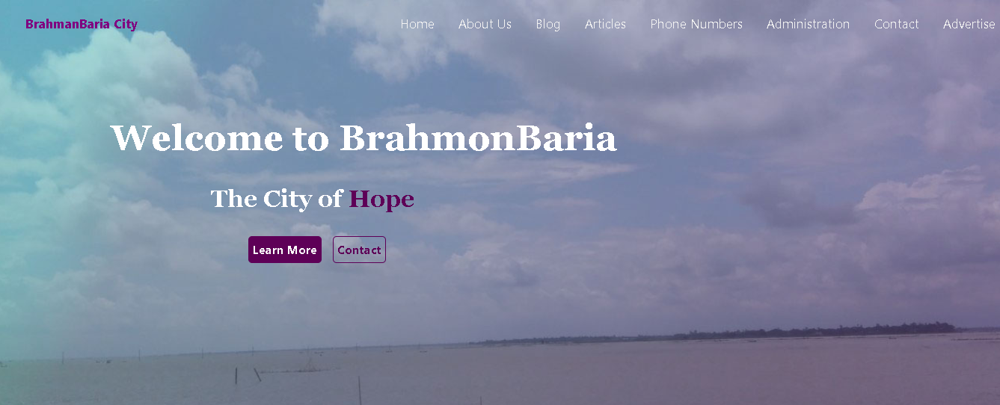
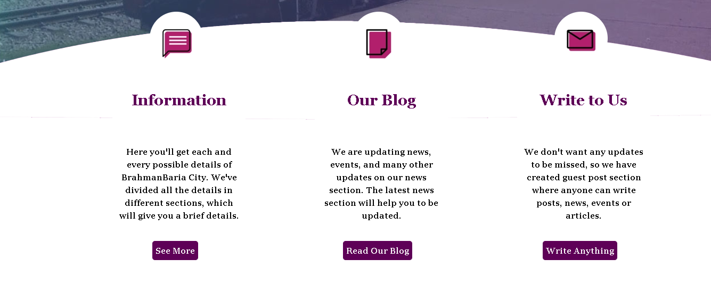
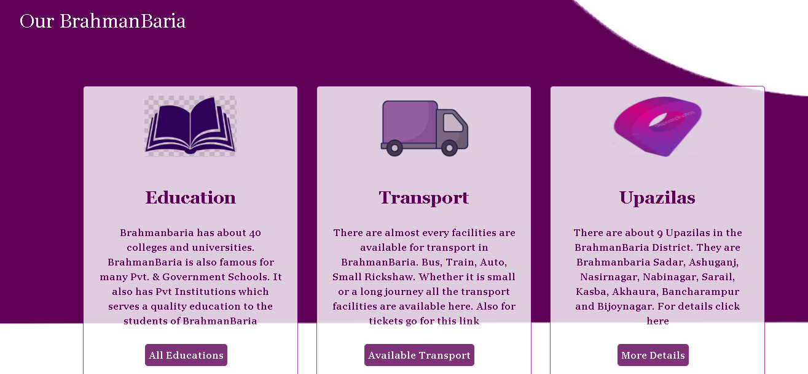
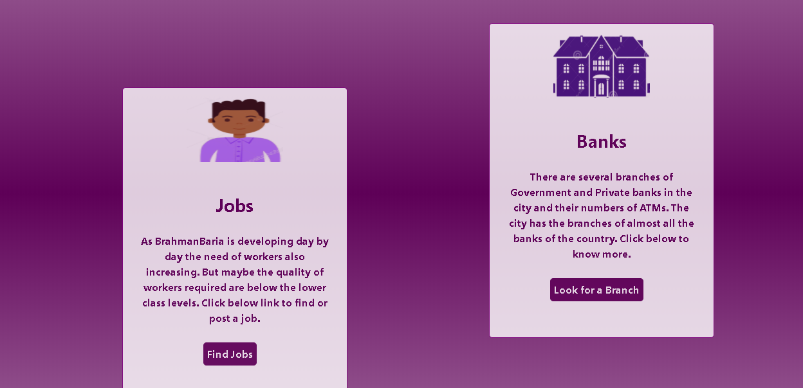
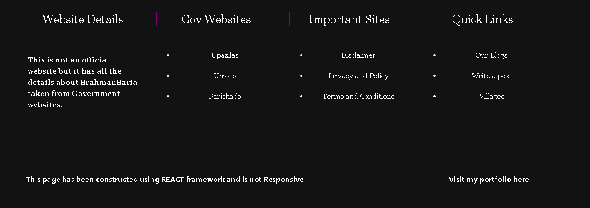

## BrahmanBaria Cities Profile

# Introduction 
This project mainly shows the important details about the important details of the City of BrahmanBaria. It is a Single Page Application with different UI and UX applications for different sections of the page. The main technologies used are ReactJs framework and CSS for styling. Adobe photoshop has also been used to create some of the images for the application. Several components has been used to create the page such: 

    - Background Carousal
    - A typing Carousal
    - Cards
    - reactstrap / react-bootstrap

The main reason to create this project is to showcase my UI and UX skills for the recruiters. 

Here are some of the screenshots of the applications. 

- - - - 
# Cover Section

# Cover Section _2

# About Section

# Informatation Section 

# Footer Section 

